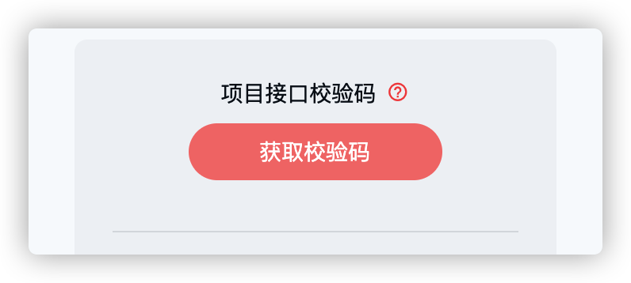

# icode 获取方法

如果希望调用课程的接口数据，那么需要配置 `icode` 。本图文节就是告诉大家如何获取并配置 `icode`

## 获取 `icode`

获取 `icode` 的步骤如下：

1. 打开 [课程列表](https://coding.imooc.com/learn/list/521.html)
2. 在右侧可查看到 **获取校验码** 按钮
   
3. 点击该按钮即可获取 **校验码**。（注意：校验码有效期为 **30天** ，过期之后需要重新获取）

## 配置 icode

`icode` 需要被配置到每次请求的 **请求头** 中，以 `icode` 为属性名。

具体配置方案如下：

### 在 微信小程序 中（1-4章节）：

1. 在 `wx.request` 中，通过 `header` 添加请求头

   ```diff
   wx.request({
     url: "...",
   +  header: {
   +    icode: '你的 icode'
   +  },
     success: (res) => {...},
   });
   ```

   

### 在 `uniapp` 中（4章节之后）：

1. 打开项目的 `/utils/request.js`

2. 为 `uni.request` 添加配置 `icode`

   ```diff
   uni.request({
   	...
   	header: {
   		...
   +		icode: '你的 icode'
   	},
   	success: ({ data }) => {...},
   	fail: (error) => {...},
   	complete: () => {...}
   });
   
   ```


至此，`icode` 配置完成。